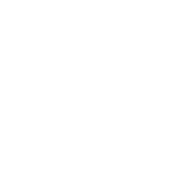

# No Clocks, LLC 

> [!NOTE]
> [No Clocks, LLC](https://noclocks.dev) is a new, cutting-edge, technology-based agency startup that seamlessly blends the expertise of seasoned Software Engineers, Web Developers, and Data Engineers.

*Default [Community Health Files](https://help.github.com/en/github/building-a-strong-community/creating-a-default-community-health-file) for all of No Clocks' open-source projects.*

## Badges

## GitHub Workflow Templates

- [Changelog Workflow](./workflow-templates/changelog.yml): Default Changelog Automation Workflow with `git-cliff`.
- [GitHub Pages - MkDocs](workflow-templates/ghpages-mkdocs.yml): Default GitHub Pages Deployment Automation Workflow with `MkDocs`.

These will be displayed when adding new workflows to a repository under the "No Clocks, LLC" organization:

***

[No Clocks, LLC](https://github.com/noclocks) | 2024
